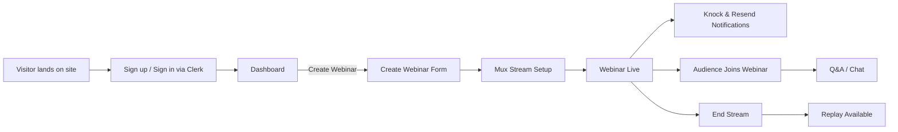
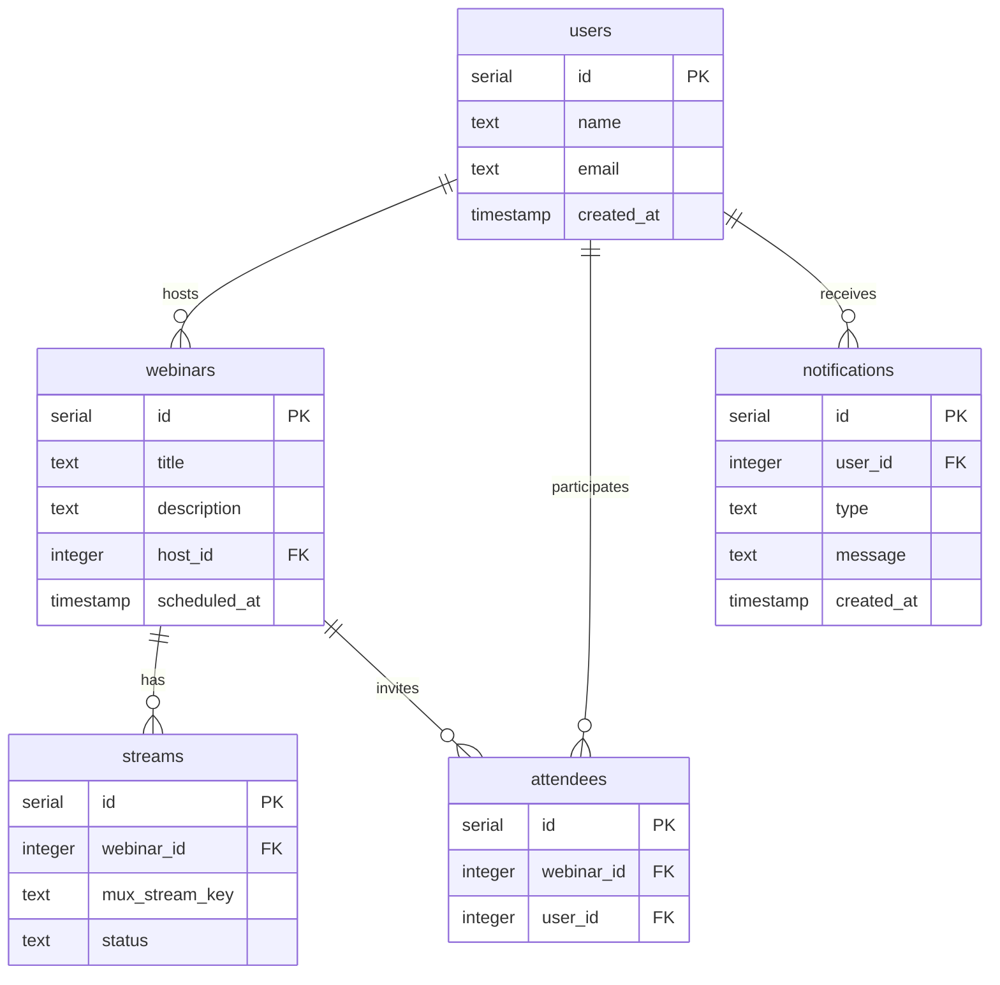

# Webinar Software Plan

## Overview
This webinar software platform will integrate industry-leading services to enable live video streaming, secure user authentication, email notifications, and in-app messaging. The following services will be utilized:
- **Mux**: For handling live video streaming and on-demand video content.
- **Clerk**: To provide user authentication and account management.
- **Resend**: For reliable email delivery and notifications.
- **Knock**: To send in-app notifications and messages.

## Architecture
- **Frontend**: 
  - User interface that manages webinar sessions, registration, and live viewing.
  - Notification system interfaced with Knock for real-time updates.
- **Backend**:
  - Integration with Clerk for user authentication and session management.
  - Mux integration for setting up live streams and handling media delivery.
  - Resend integration for email notifications such as webinar invites, reminders, and follow-ups.
  - API gateway that coordinates between frontend commands and backend service logic.

## Integration Details

### Mux
- Utilize Mux API to generate stream keys and manage live events.
- Embed Mux video player in the webinar interface for seamless streaming.

### Clerk
- Implement Clerk's authentication modules to handle sign-in, sign-up, and user sessions.
- Ensure secure access to webinar sessions based on user roles.

### Resend
- Configure Resend for sending automated emails.
- Develop email templates for confirmations, reminders, and follow-up communications.

### Knock
- Leverage Knock's API to deliver timely notifications during live sessions.
- Facilitate a notification system for scheduling updates and Q&A prompts.

## Implementation Steps
1. **Set Up Project Environment**:
   - Configure project repository and install required dependencies.
   - Set up environment variables for Mux, Clerk, Resend, and Knock APIs.

2. **Integrate Services**:
   - Integrate Clerk for authentication.
   - Connect with Mux for live video streaming features.
   - Set up Resend for email notifications.
   - Establish Knock for in-app messaging and alerts.

3. **Build UI Components**:
   - Develop responsive UI components for the webinar lobby, streaming page, and notification panels.
   - Ensure smooth user experience with real-time updates from Knock.

4. **Testing & Deployment**:
   - Conduct unit and integration tests for each service.
   - Roll out beta testing with sample webinar sessions.
   - Deploy the solution in a staged rollout, monitor performance, and gather user feedback.

## Conclusion

This plan outlines the integration of Mux, Clerk, Resend, and Knock to deliver a robust webinar software solution. Attention to seamless service integration, security, and user experience will drive the success of the webinar system.

## App Flow

## Database Schema

## Pages
- Landing / Upcoming Webinars
- Sign In / Sign Up
- Dashboard
- Create Webinar
- Webinar Details
- Live Stream
- Replay / Past Webinars
